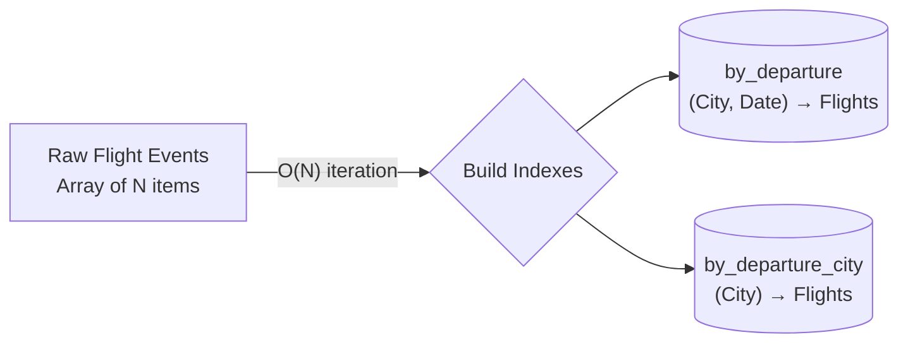
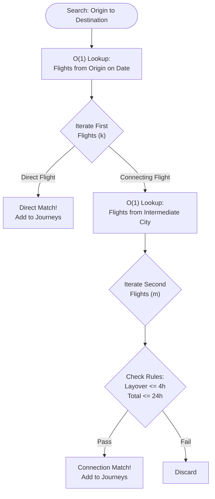

# Performance Analysis

The challenge requires finding valid flight connections based on strict business rules: same day departure, max 24h total duration, and max 4h layover.

## The Indexed Approach (O(N))
To optimize the search and guarantee fast response times even with large flight networks, the `TwoLegIndexedJourneySearch` algorithm uses **pre-indexing**. 

> [!NOTE]
> **Tailored to the Challenge Constraints**
> This default strategy is heavily optimized specifically because the business rules strictly limit a journey to a **maximum of 2 flight events**. By exploiting this small upper bound, we avoid complex graph traversal algorithms and instead use a fast, constant-depth nested loop (direct flights + one-stop flights) powered by O(1) hash map lookups.

### 1. Indexing Phase
We iterate over the `N` flights exactly once to populate two Hash Maps (`defaultdict[str, list[FlightEvent]]`):
- `by_departure`: Groups flights by their departure city code and date.
- `by_departure_city`: Groups flights solely by their departure city code.

*Time Complexity: O(N)*

### 2. Search Phase
1. We retrieve all flights departing from the `origin` by performing an O(1) hash map lookup. Let's assume there are `k` such flights.
2. We filter these `k` flights for the correct departure date.
3. For each valid first flight:
   - We check if it goes directly to the `destination`. If so, it's a valid 1-leg journey.
   - Otherwise, we look up its arrival city in the hash map (`O(1)`) to get all flights departing from that intermediate city. Let's assume there are `m` such flights.
   - We check the business rules (layover <= 4h, total duration <= 24h).

*Time Complexity: O(k × m)*

### Overall Complexity
Since `k` and `m` are typically very small constants compared to `N` (the total number of flights across the world), the search phase is extremely fast. The overall time complexity is heavily dominated by the O(N) indexing phase.

**Total Time Complexity:** `O(N)`
**Total Space Complexity:** `O(N)` (to store the hash maps)

## Extensibility
Thanks to the Strategy Pattern, if requirements change (e.g., maximum connections increased to 5), this O(N) approach might become a bottleneck or overly complex to write. A graph-based algorithm like BFS (Breadth-First Search) or Dijkstra could be implemented as a new strategy (`GraphJourneySearch`) and easily plugged in without breaking existing code.
