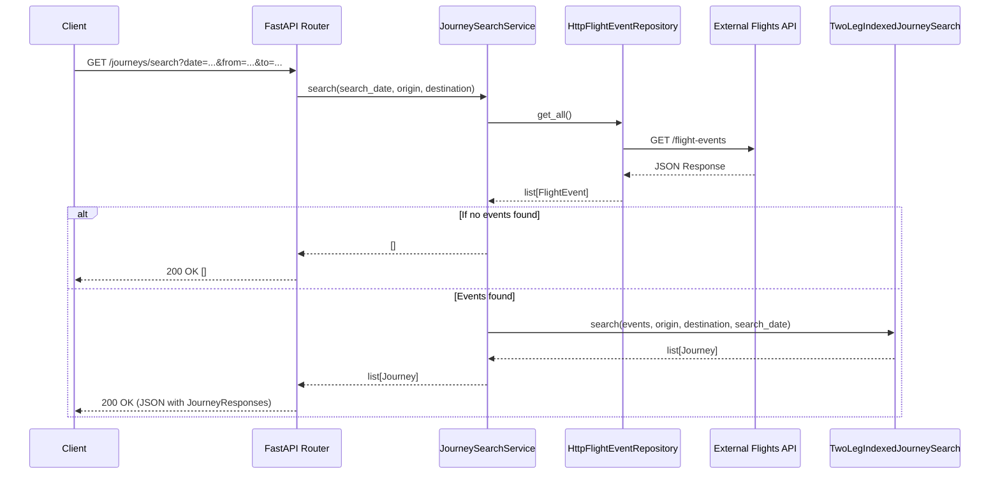

# Sequence Diagram

This diagram illustrates the data flow when a client requests flight journeys from the API.

```mermaid
sequenceDiagram
    participant Client
    participant Router as FastAPI Router
    participant Service as JourneySearchService
    participant Adapter as HttpFlightEventRepository
    participant External as External Flights API
    participant Strategy as TwoLegIndexedJourneySearch

    Client->>Router: GET /journeys/search?date=...&from=...&to=...
    
    Router->>Service: search(search_date, origin, destination)
    
    Service->>Adapter: get_all()
    Adapter->>External: GET /flight-events
    External-->>Adapter: JSON Response
    Adapter-->>Service: list[FlightEvent]
    
    alt If no events found
        Service-->>Router: []
        Router-->>Client: 200 OK []
    else Events found
        Service->>Strategy: search(events, origin, destination, search_date)
        Strategy-->>Service: list[Journey]
        Service-->>Router: list[Journey]
        Router-->>Client: 200 OK (JSON with JourneyResponses)
    end
```
